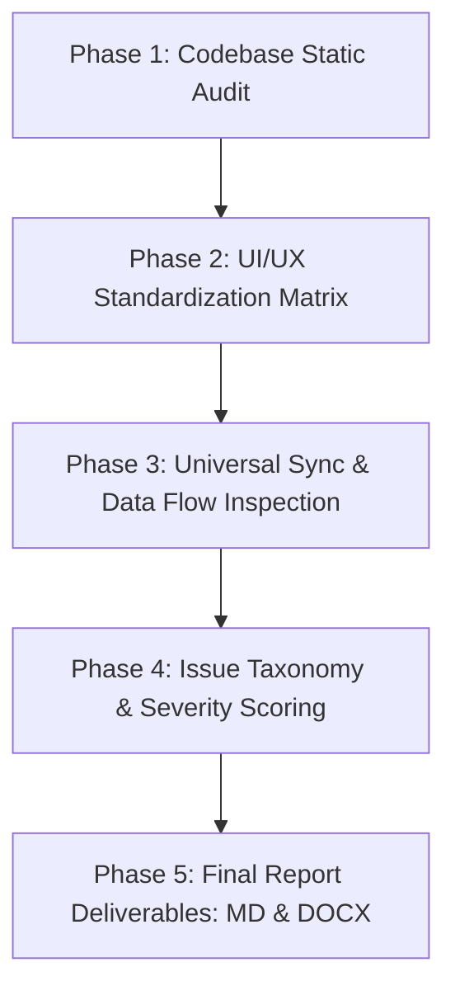

# Frontend UI/UX Standardization & Universal Data Synchronization Comprehensive Audit Plan

**Document ID:** PTF-AUDIT-PLAN-2026-09-09  
**System Target:** Print To Frame ERP (`React 18` + `Vite` + `Firebase` + `Tailwind CSS`)  
**Date:** 2026-09-09  
**Scope:** Complete Frontend Codebase Deep-Dive (All 8 Modules, Shared Primitives, Context Providers, and Real-Time Sync Pipelines)  

---

## 1. Executive Summary & Objective

Print To Frame ERP is a centralized Single-Page Application (SPA) that unifies operations across sales inquiry intake, quotation building, factory fabrication, dispatch logistics, billing/invoicing, and creative partner management. 

As features evolved rapidly, variations in UI patterns, styling tokens, component reuse, and cross-module data propagation emerged across different modules. 

The objective of this system review plan is to execute a **deep, line-by-line static and architectural audit** of the frontend codebase to establish:
1. **Frontend UI/UX Standardization**: Total visual and ergonomic harmony, adhering strictly to design tokens, responsive breakpoints, accessible contrast ratios, and shared UI primitives (`PageHeader`, `FilterBar`, `StatusBadge`, `UserAvatar`, `DetailModalLayout`, etc.).
2. **Universal Data Synchronization**: Seamless real-time data integrity across Firestore listeners, optimistic local state updates, entity lifecycle continuity (`Lead` $\rightarrow$ `Deal` $\rightarrow$ `Project` $\rightarrow$ `Logistics` $\rightarrow$ `Invoice` $\rightarrow$ `Customer` $\rightarrow$ `Partner`), user profile presence, and in-app messaging badge propagation.

---

## 2. Codebase Surface & Audit Scope

The review covers 100% of the active frontend codebase across 8 core feature areas:

| Module Domain | File Surface | Inspection Focus |
| :--- | :--- | :--- |
| **CRM & Sales** | `Leads.jsx`, `LeadCardDetails.jsx`, `Deals.jsx`, `Customers.jsx`, `Partners.jsx`, `QuotationBuilder.jsx`, `ContactSyncModal.jsx`, `PartnerQRModal.jsx` | Ad-hoc styles, modal architecture (1893-line `LeadCardDetails.jsx`), loose customer matching, quotation lifecycle, Kanban drag-and-drop. |
| **Operations** | `FabricationWorks.jsx`, `FabricationCardDetails.jsx`, `Logistics.jsx`, `LogisticsCardDetails.jsx`, `FrameBlueprintPreview.jsx` | Common UI primitive usage, status lifecycle progression, manufacturing checklist consistency, logistics delivery tracking. |
| **Executive Dashboard** | `Dashboard.jsx`, `NotificationsView.jsx` | `PageHeader` KPI pills, domain filter switching, work queues, notification feed avatar resolution, clear-alert triggers. |
| **Admin & Security** | `AdminPanel.jsx`, `AgentDatabase.jsx`, `PermissionsManager.jsx` | RBAC permissions matrix styling, database telemetry export, user approval provisioning, role synchronization. |
| **Tools & Messaging** | `CostCalculator.jsx`, `Messages.jsx`, `MiniChatDrawer.jsx`, `FloatingMessageToast.jsx` | Ad-hoc header elimination in Cost Calculator, Master-Detail layout in Messages, floating drawer theme parity, unread badge sync. |
| **Shared Primitives** | `src/components/common/ui/*` (`PageHeader`, `FilterBar`, `StatusBadge`, `SortableTable`, `Kanban*`, `UserAvatar`, `TwoToneIcon`, `detail-modal/*`) | Primitive reusability, prop contract completeness, accessibility rings, dark/light token adherence. |
| **Auth & Public Views**| `Login.jsx`, `PartnerRegistration.jsx`, `ReferralForm.jsx`, `UserProfile.jsx` | Public registration theme consistency, image cropping modal integration, profile avatar sync across views. |
| **State & Core Services** | `App.jsx`, `MessagingContext.jsx`, `PermissionsContext.jsx`, `firestoreSync.js`, `firebase.js`, `auditLog.js` | Firestore real-time subscriptions, optimistic UI updates vs snapshot consistency, race conditions, audit logging coverage. |

---

## 3. Six Core Review Pillars

### Pillar 1: Design Tokens, Theming & Visual Hierarchy
* **Brand Token Adherence:** Compare `brand-tokens.json`, `tailwind.config.js`, and `src/index.css` against all component usages. Flag hardcoded Tailwind colors (e.g., `bg-emerald-500/20`, `text-blue-400`, `text-gray-400`) and map them to semantic CSS variables (`--color-primary`, `--color-surface-*`, `--color-status-*`).
* **Light/Dark Mode Dual-Theme Parity:** In dark mode, pastel accents (`emerald-400`, `cyan-400`) look fine, but in `[data-theme='light']`, their contrast drops below WCAG AA (near 1.8:1). Audit every status badge and text element to ensure `-on` status tokens (`status-success-on`, `status-ready-on`, etc.) are utilized.
* **Typography & Hierarchy:** Ensure consistent typography across views: `font-sans` (Poppins/Inter) for general UI, `font-display` (Hanken Grotesk) for primary titles, and `font-mono` (JetBrains Mono) for financial amounts, invoice numbers, and technical dimensions.
* **Surface Elevation & Glassmorphism:** Standardize container backgrounds (`bg-surface-container/60`), borders (`border-outline-variant/60`), border radii (`rounded-2xl`), and elevation glows.

### Pillar 2: UI Component Reuse & Common Primitive Adoption
* **PageHeader Standardization:** Audit views that still declare inline `<h1>` or custom header containers (e.g., `CostCalculator.jsx`, `QuotationBuilder.jsx`) and replace them with standard `<PageHeader>` components equipped with live KPI pills.
* **FilterBar Universal Adoption:** Guarantee all module views with category switching and search inputs leverage `<FilterBar>` with badge counts and active tab indicators.
* **StatusBadge Unification:** Replace custom `` status pills across views with `<StatusBadge>` to enforce consistent status styling, animations, and dot pulses.
* **UserAvatar & Fallback Resolution:** Audit every location displaying a customer, partner, colleague, or driver avatar. Standardize to `<UserAvatar>` with preset role fallback icons (`Hammer`, `Palette`, `Briefcase`, `Layers`, `Sparkles`, `Shield`).
* **Modal Compound Component Suite:** Refactor standalone modal code to use the established compound modal structure (`<ModalWrapper>`, `<DetailModalLayout>`, `<DetailModalHeader>`, `<DetailModalContent>`, `<DetailModalSidebar>`, `<DetailModalFooter>`).

### Pillar 3: Universal Real-Time Data Sync Architecture
* **Single-Source Firestore Subscriptions:** Audit `subscribeToCollection` and `onSnapshot` listeners in `App.jsx` and feature components. Verify that no duplicate listeners exist and that all listeners properly clean up on unmount.
* **Optimistic Updates vs. Snapshot Merging:** Ensure that local optimistic state updates (`setInvoices`, `setLeads`, `setProjects`) avoid visual jumping or rollback flickers when Firestore snapshot events fire.
* **Atomic Batch Operations:** Ensure multi-document mutations (e.g., lead conversion to deal, user approval, invoice payment) leverage `batchWrite` or transactions to eliminate partial write risks.
* **Network & Offline Resilience:** Verify that network drops, latency, and permission errors trigger clean UI feedback via `handleFirestoreError` and sonner toasts without crashing the view.

### Pillar 4: Cross-Module Relational Data Synchronization
* **Entity Lifecycle Traceability:** Trace entity IDs across transitions (`Lead` $\rightarrow$ `Deal` $\rightarrow$ `Project` $\rightarrow$ `LogisticsJob` $\rightarrow$ `Invoice` $\rightarrow$ `Customer` $\rightarrow$ `Partner Accrual`). Guarantee that converted entities preserve reference keys (`originalLeadId`, `leadId`, `_firestoreId`, sequential `id`).
* **Normalization of Customer Identification:** Eliminate loose string matching (e.g., in `Customers.jsx` matching solely by name, email, or phone) by standardizing on immutable identifiers (`nic`, `customerId`).
* **Automated Stage Progression:** Verify that state updates in one module automatically trigger corresponding stage advancements in downstream modules (e.g., marking Advance invoice paid moves lead stage to 'Received' and triggers fabrication readiness).

### Pillar 5: User Session, Profile & Messaging Sync
* **Session & Profile Synchronization:** Confirm that edits to `currentUser` (name, avatar, preset, role) in `UserProfile.jsx` instantly propagate to the global navigation header, sidebar, profile drawer, and active chat avatars in real-time.
* **Messaging & Notification Badges:** Audit `MessagingContext.jsx` to ensure that unread message counters, sidebar badges, and `FloatingMessageToast.jsx` remain perfectly synchronized across active conversation windows.
* **Audit Trail Coverage:** Ensure every state-mutating operation (invoice created/paid, lead stage changed, role permissions modified, partner approved) invokes `logActivity` to maintain a complete history in `auditLog`.

### Pillar 6: Responsive UX & Accessibility (a11y)
* **Mobile Touch Targets & Safe Areas:** Audit button dimensions ($\ge 44 \times 44\text{px}$), mobile header spacing, and safe area paddings (`pb-safe`, `pt-safe`) for notched devices.
* **Kanban Mobile Snapping:** Ensure mobile horizontal Kanban columns snap smoothly (`snap-x-mandatory`, `snap-start-card`).
* **Accessibility & Focus Rings:** Ensure standard `:focus-visible` outlines, proper ARIA labels on icon-only buttons, keyboard navigation support, and reduced-motion media query compliance.

---

## 4. Review Execution Methodology & Timeline

### Phase 1: Codebase Static Audit & Component Matrix
- Systematic grep and AST inspection of all 23 JSX component files.
- Inventory of non-standard CSS classes, custom headers, and direct palette styling.

### Phase 2: UI/UX Standardization Matrix
- Visual component gap analysis against `<PageHeader>`, `<FilterBar>`, `<StatusBadge>`, `<UserAvatar>`, and `<DetailModalLayout>`.
- Light/Dark theme color contrast validation.

### Phase 3: Universal Sync & Data Flow Inspection
- Trace data mutations from `App.jsx` down through props and context providers.
- Audit Firestore subscription lifecycle, optimistic UI updates, and relational key linkages.

### Phase 4: Issue Taxonomy & Severity Scoring
- Classify findings into:
  - **P1 (Critical):** Data desync, race conditions, broken state propagation, severe theme contrast failures.
  - **P2 (High):** Missing common primitives, inconsistent header/filter layouts, unhandled optimistic update flickers.
  - **P3 (Moderate):** Hardcoded palette colors, loose customer matching, redundant CSS classes.
  - **P4 (Minor):** Micro-interaction polish, typography adjustments, minor responsive alignment tweaks.

### Phase 5: Deliverables & Verification
- Compile and publish the **Comprehensive Audit Report** in both Markdown (`docs/UI_UX_Standardization_and_Universal_Sync_Audit_Report.md`) and formal Word format (`Frontend_UIUX_Standardization_and_Universal_Sync_Audit_Plan_2026_09_09_07_25.docx`).
- Run quality gates: `npm test`, `npm run build`, and `npm run lint`.

---

## 5. Verification & Quality Gates

1. **Unit Test Suite:** Run `npm test` to verify Vitest unit tests pass with zero regressions.
2. **Production Bundle Build:** Run `npm run build` to ensure clean asset compilation, tree shaking, and zero Vite warnings.
3. **Static Linting:** Run `npm run lint` across the entire codebase.
4. **Firestore Rules Emulator:** Run `npm run test:rules` to confirm client-side permission assumptions are validated against `firestore.rules`.
