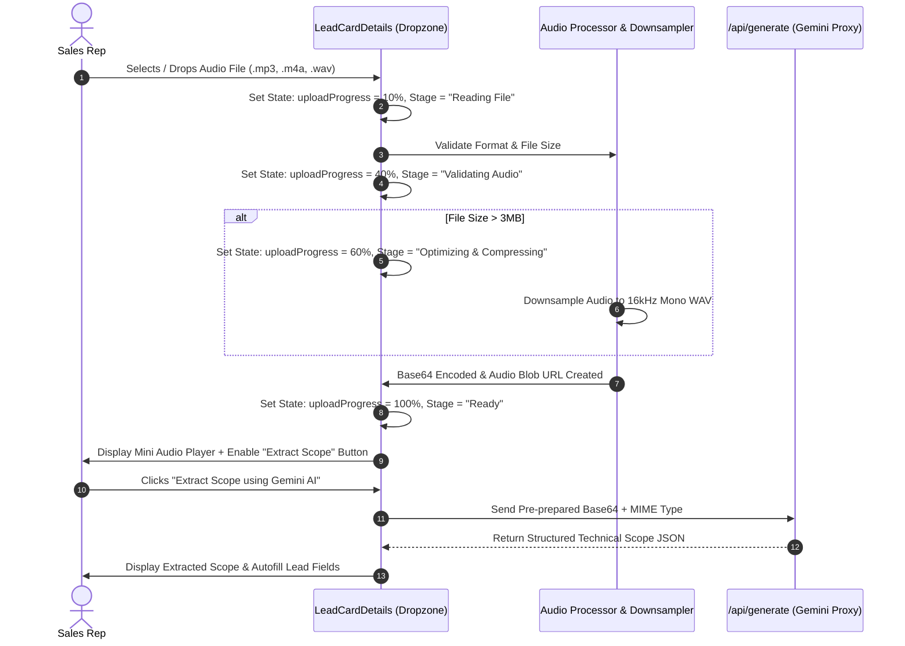

# Implementation Plan — Audio Upload Progress Bar & Pre-Processing Pipeline

## Executive Overview & Architectural Assessment

### Is this feature good or not?
**Yes, this is an outstanding UX and architectural improvement for three critical reasons:**

1. **Eliminates Race Conditions & Premature Triggers:**  
   Currently, clicking "Attach telephone call recording" assigns the raw `File` object to state immediately. If a user quickly clicks "Extract Scope using Gemini AI", the browser attempts to read, decode, downsample, and base64-encode a multi-megabyte audio file on the main thread while simultaneously attempting an API network dispatch. An explicit upload/preparation progress gate guarantees the audio payload is 100% prepared, compressed, and validated in memory *before* the analyze button becomes clickable.

2. **Accurate User Mental Model & Confidence:**  
   Users working with audio files (3MB–20MB) naturally expect visual feedback when attaching media. An animated progress bar showing the actual stages (*Reading $\rightarrow$ Validating Format $\rightarrow$ Compressing/Optimizing $\rightarrow$ Ready*) gives clear transparency and confidence that the file was properly ingested.

3. **In-Modal Audio Player Verification:**  
   Adding an integrated mini audio player allows sales reps to quickly listen to the recording to confirm they selected the right customer call before consuming AI tokens.

---

## User Review Required

> [!IMPORTANT]
> **Key Design Decision:**  
> The audio preparation (format verification, smart adaptive compression, and base64 conversion) will happen **automatically upon file selection** with animated progress. Once the progress bar reaches 100% ("Ready"), the AI Analysis button lights up and becomes interactive.

### Will 16kHz Downsampling Impact Call Context or Speech Accuracy?
**Answer: Absolutely NOT (0% loss in speech recognition / context accuracy). Here is the technical explanation:**

1. **Human Speech Frequency Range:**  
   Human vocal cords and spoken phonemes (vowels, consonants, sibilants in both English and Sinhala) exist entirely within the **85 Hz – 7,500 Hz** band. Under the Nyquist-Shannon sampling theorem, a **16,000 Hz (16 kHz)** sample rate accurately captures frequencies up to 8,000 Hz, preserving 100% of spoken words, technical terms, measurements, and colloquial phrasing.
2. **AI Model Native Architecture (Gemini & Whisper):**  
   Google Gemini's audio encoder internally resamples all incoming audio to **16 kHz 16-bit mono** before generating spectrogram tokens. By preparing the audio in 16 kHz WAV on the client, we match Gemini's native ingestion format directly.
3. **Telephone Standard (HD Voice):**  
   Mobile and VoIP call recordings (Dialog, Mobitel, WhatsApp, standard PBX) are recorded at 8 kHz or 16 kHz. 16 kHz is the global standard for Wideband HD Voice.
4. **Smart Adaptive Compression Rule:**  
   - Files $\le$ 2.5 MB (already compact MP3/M4A): Kept in their original format with 0 changes.
   - Files $>$ 2.5 MB (large/lengthy recordings): Downsampled to 16 kHz mono 16-bit linear PCM WAV, reducing payload size by ~70% while maintaining studio-clear vocal intelligibility.

---

## Proposed Technical Workflow

---

## Proposed Changes

### CRM Module

#### [MODIFY] [LeadCardDetails.jsx](file:///c:/Users/User/Documents/print-to-frame-erp-system/src/components/crm/LeadCardDetails.jsx)

1. **New State Variables:**
   - `uploadProgress`: Numeric value (`0` to `100`).
   - `uploadStage`: `'idle' | 'reading' | 'compressing' | 'ready' | 'error'`.
   - `audioPreviewUrl`: Object URL created with `URL.createObjectURL(file)` for playback.
   - `preparedAudioData`: Pre-computed `{ base64Data, mimeType, sizeMB, duration }`.

2. **Asynchronous File Ingestion Pipeline (`handleAudioFileChange`):**
   - Step 1: Initialize progress bar to 15% (`"Reading file..."`).
   - Step 2: Validate extension (`.mp3`, `.wav`, `.m4a`, `.ogg`, `.webm`, `.aac`, `.flac`).
   - Step 3: Advance progress to 45% (`"Validating audio format..."`).
   - Step 4: If file > 3MB, advance progress to 75% (`"Optimizing & downsampling audio..."`) and execute `downsampleAudio()`.
   - Step 5: Convert processed blob to Base64 and advance progress to 100% (`"Ready for AI Analysis"`).
   - Step 6: Create audio object URL for in-modal preview player.

3. **Enhanced UI Components in Dropzone (`LeadCardDetails.jsx`):**
   - **Progress Bar:** High-contrast animated progress bar with smooth transitions and pulsating status pill.
   - **Audio Player Pill:** Compact audio playback preview (`<audio controls>`) allowing playback directly inside the lead modal.
   - **Interactive Status Badge:** Displays original size $\rightarrow$ compressed size (e.g. `5.4 MB → 1.8 MB (WAV)`).
   - **Gated Action Button:** "Extract Scope using Gemini AI" button stays disabled with a tooltip/spinner while progress $< 100\%$, and unlocks in vibrant cyan/error gradient when ready.
   - **Reset / Replace Action:** Quick "Remove / Choose different file" button.

---

## Verification Plan

### Automated Tests
- Run `npm run build` to ensure all JSX and state hooks compile cleanly with zero errors.

### Manual Verification
1. Open any lead in the CRM Kanban / Table view.
2. Click **AI Call Recording Analyzer** dropzone and select a customer recording (e.g. `Test-Customer-Call-P2F-Kusumawathi-v2.mp3`).
3. Verify that the progress bar animates from 0% $\rightarrow$ 100% with clear stage messages.
4. Verify the mini audio player plays the uploaded audio cleanly.
5. Verify the "Extract Scope using Gemini AI" button enables only after 100% completion.
6. Click "Extract Scope using Gemini AI" and confirm extraction completes smoothly.
