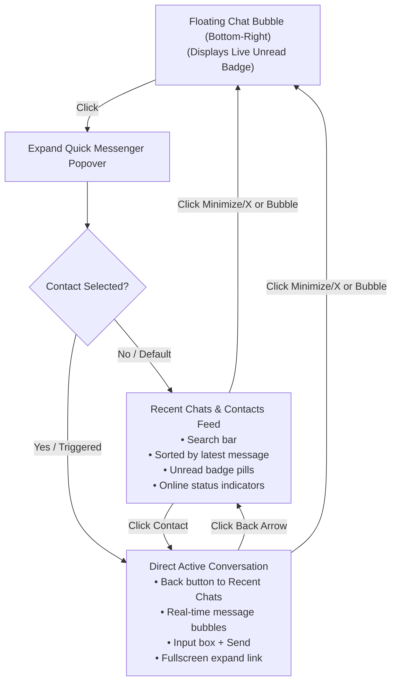

# Implementation Plan — Persistent Floating Bottom-Right Quick Messenger Widget

## 1. Problem & Feature Objective
Currently, the Mini-Chat Drawer only appears when explicitly triggered from a notification pop-up or when clicking "Open Quick Chat" inside the Notifications center. When closed or when working across various ERP modules (Leads, Deals, Invoices, Fabrication, Logistics), there is no persistent on-screen launcher to quickly check recent messages or start conversations without navigating away to the full Messages tab.

### Goal:
Transform the bottom-right chat into an **Always-Floating Quick Messenger Widget** that:
1. Sits persistently in the bottom-right corner as a stylish, unobtrusive Floating Action Button (FAB) with live unread counter badge.
2. Expands on click into a two-level floating messenger window:
   - **Level 1: Recent Conversations & Contacts List** (view latest threads, message previews, unread badges, and search contacts).
   - **Level 2: Direct Active Conversation** (chat directly with message stream, reply, and quick back button to return to the list).
3. Allows 1-click collapse/expand without losing draft messages or active conversation state.

---

## 2. Architecture & UI/UX Workflow

---

## 3. User Review Required

> [!IMPORTANT]
> **Floating Widget Positioning & Behavior:**
> - The floating button will be positioned at `bottom-5 right-5` (z-index 50) with a modern cyber/dark glassmorphism styling consistent with the Print-To-Frame theme.
> - Clicking anywhere outside or clicking the floating toggle button will smoothly collapse/expand the window.
> - Toast notification pop-ups will appear just above the floating button so they never overlap.

---

## 4. Proposed Changes

### Component 1: Redesign `MiniChatDrawer.jsx` into `FloatingQuickMessenger.jsx`
#### [MODIFY] [`src/components/tools/MiniChatDrawer.jsx`](file:///c:/Users/User/Documents/print-to-frame-erp-system/src/components/tools/MiniChatDrawer.jsx)
- **Floating Action Launcher Button:**
  - Sleek circular button with gradient glow, message icon, and pulse animation when unread messages exist.
  - Live numerical unread badge (e.g. `3`).
- **Recent Chats Summary View (Level 1):**
  - Search input to filter team members / partners.
  - Aggregates conversation threads from `messages`, showing the latest message snippet, timestamp, sender avatar, and unread counter.
  - Quick contact picker for all colleagues.
- **Direct Chat View (Level 2):**
  - Header with Back Arrow (`ArrowLeft`), recipient avatar, online indicator, and external link to full Messages module.
  - Message bubble list with scroll-to-bottom.
  - Clean text input with Enter-to-send.
- **Smooth Collapse/Expand Animation:**
  - Uses Tailwind CSS `transition-all duration-300`, `scale-95`/`scale-100`, and `fade-in`.

---

### Component 2: Update `MessagingContext.jsx`
#### [MODIFY] [`src/context/MessagingContext.jsx`](file:///c:/Users/User/Documents/print-to-frame-erp-system/src/context/MessagingContext.jsx)
- Add `isQuickMessengerOpen` and `toggleQuickMessenger` state.
- Add `recentConversations` memoized selector that groups messages by `channelId`, extracts the latest message per participant, and calculates unread counts per thread.
- Ensure `openMiniChat(contact)` opens the messenger directly into Level 2 (Direct Chat) with that contact.
- Provide `backToRecentChats()` to switch from Level 2 to Level 1 seamlessly.

---

### Component 3: Update `App.jsx`
#### [MODIFY] [`src/App.jsx`](file:///c:/Users/User/Documents/print-to-frame-erp-system/src/App.jsx)
- Ensure `<MiniChatDrawer>` (the Persistent Floating Messenger) remains active on all authenticated pages.
- Adjust toast stack positioning so floating message pop-ups appear neatly above the widget without collisions.

---

## 5. Verification Plan

### Automated Build Verification
- Execute `npm run build` to guarantee 0 syntax errors, valid module imports, and bundle optimization.

### Manual & Interactive Verification
1. **Floating Button Appearance:** Check bottom-right of Dashboard, Leads, Deals, and Invoices.
2. **Expand & Recent Chats:** Click the floating button $\rightarrow$ verify it expands to show recent conversation threads and colleague list.
3. **Open Specific Conversation:** Click any colleague in the recent chats list $\rightarrow$ verify it transitions to the active chat screen with message history.
4. **Send Message:** Send a message $\rightarrow$ verify instant delivery and Firestore synchronization.
5. **Back Navigation:** Click the back arrow $\rightarrow$ verify it returns to the recent chats list without closing the widget.
6. **Toast Integration:** Trigger an incoming message $\rightarrow$ verify pop-up appears and clicking "Open Chat" transitions directly into that person's conversation.
7. **Deployment:** Commit to `staging`, push to GitHub, promote to `main`, and verify live preview.
