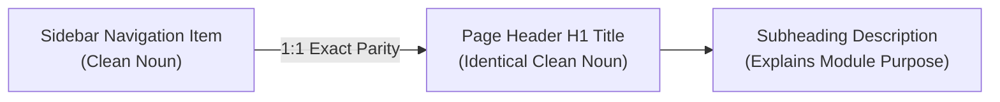

# Implementation Plan — ERP Nomenclature Standardization & 1:1 Navigation-to-Header Alignment

## 1. Problem Statement & UX Objective
A systematic audit of the Print-To-Frame ERP navigation and page views revealed significant nomenclature divergence across 12 out of 14 modules (85% mismatch rate). For example:
- Sidebar: **"Leads"** $\rightarrow$ Page Header: **"Leads Intake"**
- Sidebar: **"Deals"** $\rightarrow$ Page Header: **"Deals Pipeline"**
- Sidebar: **"User Management"** $\rightarrow$ Page Header: **"User & Access Directory"**
- Sidebar: **"Partner Database"** $\rightarrow$ Page Header: **"Partner Network"**
- Sidebar: **"Invoices Database"** $\rightarrow$ Page Header: **"Consolidated Invoices"**
- Sidebar: **"Logistics"** $\rightarrow$ Page Header: **"Logistics Hub"**
- Sidebar: **"Cost Calculator"** $\rightarrow$ Page Header: **"Pricing Engine"**
- Sidebar: **"My Profile"** $\rightarrow$ Page Header: **"User Profile & Identity Settings"**

### UX Objective:
Implement a **1:1 Strict Naming Parity Rule** across all 14 main navigation tabs and their corresponding PageHeader titles, complemented by descriptive, elegant secondary subtitles. This eliminates cognitive dissonance, accelerates user muscle memory, and makes team onboarding effortless.

---

## 2. Standardization Matrix

| Tab ID | Nav Group | Standardized Sidebar Label | Standardized Page Header Title | Standardized Explanatory Subtitle |
|---|---|---|---|---|
| `dashboard` | Overview | **Dashboard** | **Dashboard** | Real-time operational metrics, project throughput, and financial performance. |
| `notifications` | Overview | **Notifications** | **Notifications** | Real-time feed of system status changes, alerts, and direct team messages. |
| `leads` | CRM | **Leads** | **Leads** | Nurture incoming inquiries from intake to quotation and 75% advance payment. |
| `pipeline` | CRM | **Deals** | **Deals** | Track committed projects across engineering queues, fabrication handover, and final delivery. |
| `customers` | Databases | **Customers** | **Customers** | Centralized client registry, relationship profiles, order histories, and communications. |
| `agents` | Databases | **User Management** | **User Management** | Manage authenticated identities, dynamic RBAC role assignments, and pending registrations. |
| `partners` | Databases | **Partners** | **Partners** | Collaborative network of Creative Agencies, Digital Art Printers, and Referral Agents. |
| `invoices` | Databases | **Invoices** | **Invoices** | Central billing ledger for advance receipts, balance settlements, and financial audits. |
| `projects` | Operations | **Fabrication Works** | **Fabrication Works** | Manage specialist manufacturing from raw steel fabrication to finished gallery-wraps. |
| `logistics` | Operations | **Logistics** | **Logistics** | Manage dispatch schedules, driver allocations, material pickups, and customer deliveries. |
| `calculator` | Tools | **Cost Calculator** | **Cost Calculator** | Algorithmic steel framing pricing, BOM estimation, QA, and margin calculator. |
| `messages` | Tools | **Messages** | **Messages** | Direct 1-on-1 team messaging, real-time collaboration, and file sharing. |
| `profile` | Settings | **My Profile** | **My Profile** | Manage your personal credentials, studio identity, contact details, and workspace preferences. |
| `admin` | Settings | **System Overview** | **System Overview** | Executive system analytics, database storage health, and system audit logs. |

---

## 3. User Review Required

> [!IMPORTANT]
> **Key Decisions to Confirm:**
> 1. In the **Databases** group: shortened `Customer Database`, `Partner Database`, and `Invoices Database` to sleek, consistent nouns: **`Customers`**, **`Partners`**, and **`Invoices`** (with `User Management` remaining explicit).
> 2. All Page Headers will match the sidebar labels with 100% word-for-word parity, while the detailed descriptions remain in the subtitles below the titles.

---

## 4. Proposed File Changes

### Component 1: Navigation Sidebar & App Routes
#### [MODIFY] [`src/App.jsx`](file:///c:/Users/User/Documents/print-to-frame-erp-system/src/App.jsx)
- Update NavLink labels:
  - `Customer Database` $\rightarrow$ `Customers`
  - `Partner Database` $\rightarrow$ `Partners`
  - `Invoices Database` $\rightarrow$ `Invoices`

### Component 2: Overview Modules
#### [MODIFY] [`src/components/dashboard/Dashboard.jsx`](file:///c:/Users/User/Documents/print-to-frame-erp-system/src/components/dashboard/Dashboard.jsx)
- Update Header: `Admin Dashboard` $\rightarrow$ `Dashboard`
#### [MODIFY] [`src/components/dashboard/NotificationsView.jsx`](file:///c:/Users/User/Documents/print-to-frame-erp-system/src/components/dashboard/NotificationsView.jsx)
- Update Header: `Notifications & Activity Hub` $\rightarrow$ `Notifications`

### Component 3: CRM Modules
#### [MODIFY] [`src/components/crm/Leads.jsx`](file:///c:/Users/User/Documents/print-to-frame-erp-system/src/components/crm/Leads.jsx)
- Update PageHeader title: `Leads Intake` $\rightarrow$ `Leads`
#### [MODIFY] [`src/components/crm/Deals.jsx`](file:///c:/Users/User/Documents/print-to-frame-erp-system/src/components/crm/Deals.jsx)
- Update PageHeader title: `Deals Pipeline` $\rightarrow$ `Deals`

### Component 4: Databases Modules
#### [MODIFY] [`src/components/crm/Customers.jsx`](file:///c:/Users/User/Documents/print-to-frame-erp-system/src/components/crm/Customers.jsx)
- Update PageHeader title: `Customer Database` $\rightarrow$ `Customers`
#### [MODIFY] [`src/components/admin/AgentDatabase.jsx`](file:///c:/Users/User/Documents/print-to-frame-erp-system/src/components/admin/AgentDatabase.jsx)
- Update PageHeader title: `User & Access Directory` $\rightarrow$ `User Management`
#### [MODIFY] [`src/components/crm/Partners.jsx`](file:///c:/Users/User/Documents/print-to-frame-erp-system/src/components/crm/Partners.jsx)
- Update PageHeader title: `Partner Network` $\rightarrow$ `Partners`
#### [MODIFY] [`src/components/crm/Invoices.jsx`](file:///c:/Users/User/Documents/print-to-frame-erp-system/src/components/crm/Invoices.jsx)
- Update PageHeader title: `Consolidated Invoices` $\rightarrow$ `Invoices`

### Component 5: Operations & Tools Modules
#### [MODIFY] [`src/components/operations/Logistics.jsx`](file:///c:/Users/User/Documents/print-to-frame-erp-system/src/components/operations/Logistics.jsx)
- Update PageHeader title: `Logistics Hub` $\rightarrow$ `Logistics`
#### [MODIFY] [`src/components/tools/CostCalculator.jsx`](file:///c:/Users/User/Documents/print-to-frame-erp-system/src/components/tools/CostCalculator.jsx)
- Update PageHeader title: `Pricing Engine` $\rightarrow$ `Cost Calculator`
#### [MODIFY] [`src/components/tools/Messages.jsx`](file:///c:/Users/User/Documents/print-to-frame-erp-system/src/components/tools/Messages.jsx)
- Add standard PageHeader: `Messages` (with subtitle) for the full view.

### Component 6: Settings Modules
#### [MODIFY] [`src/components/common/UserProfile.jsx`](file:///c:/Users/User/Documents/print-to-frame-erp-system/src/components/common/UserProfile.jsx)
- Update PageHeader title: `User Profile & Identity Settings` $\rightarrow$ `My Profile`
#### [MODIFY] [`src/components/admin/AdminPanel.jsx`](file:///c:/Users/User/Documents/print-to-frame-erp-system/src/components/admin/AdminPanel.jsx)
- Add standard PageHeader: `System Overview`

---

## 5. Verification Plan

### Automated Build Verification
- Run `npm run build` to verify 0 errors.

### Manual Review & Testing
1. Click through all 14 sidebar navigation tabs.
2. Verify that clicking on each tab immediately presents an identical H1 / PageHeader title at the top of the viewport.
3. Verify subtitle clarity, layout aesthetics, and mobile responsive headers.
4. Promote to `staging` and `main` live production.
