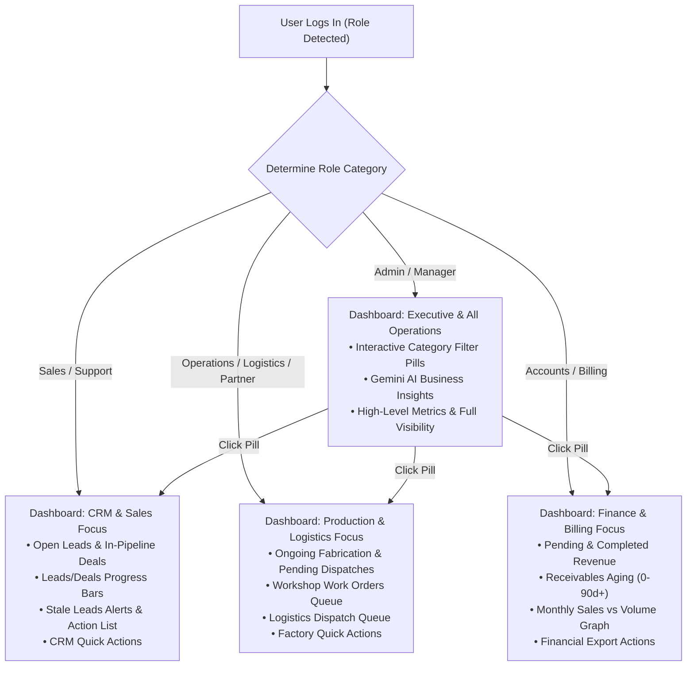

# Implementation Plan — Role-Based Dashboard Categorization & Modular Views

## 1. Problem Statement & Functional Objective
Currently, the Dashboard presents all 18+ widgets, financial metrics, production queues, and CRM cards simultaneously to every user regardless of their role. A workshop technician is exposed to financial aging and sales pipelines; a sales representative sees vehicle dispatch queues; and an accountant is overwhelmed by fabrication blueprints.

### Objective:
Categorize all Dashboard items into **Four Dedicated Functional Domains** matching the ERP's RBAC structure:
1. 🎯 **CRM & Sales:** Open Leads, Active Deals, Leads/Deals Pipeline progress, Stale Leads alerts, Leads Needing Action, and CRM Quick Actions.
2. 🔨 **Production & Logistics:** Ongoing Fabrication, Ready for Inspection, Logistics Pickups/Deliveries, Cutting floor queues, and Manufacturing Quick Actions.
3. 💰 **Finance & Billing:** Pending & Completed Revenue hero metrics, 0–90d+ Receivables Aging, Monthly Sales vs Production charts, and Invoices ledger.
4. ⚙️ **Systems & Executive (All Operations):** Unrestricted enterprise overview, Gemini AI Strategic Insights, multi-department aggregation, and Category Switcher Toolbar.

---

## 2. Dynamic Workflow & Category Architecture

---

## 3. User Review Required

> [!IMPORTANT]
> **Category Switcher for Administrators & Multi-Role Staff:**
> - Super Administrators and Operations Managers will have an interactive **Category Switcher Toolbar** at the top of the dashboard (`All Operations`, `CRM & Sales`, `Production`, `Finance`) allowing them to switch views with 1 click.
> - Non-admin users (e.g. Sales, Technicians, Accounts) will automatically land on their customized category view while maintaining clean, uncluttered access to their daily tasks.

---

## 4. Proposed File Changes

### Component: `src/components/dashboard/Dashboard.jsx`
#### [MODIFY] [`src/components/dashboard/Dashboard.jsx`](file:///c:/Users/User/Documents/print-to-frame-erp-system/src/components/dashboard/Dashboard.jsx)
1. **Add `activeCategory` State:**
   - Detects `currentUser?.role` and initializes default category:
     * `Sales`, `Support`, `Business Client` $\rightarrow$ `'crm'`
     * `Operations`, `Logistics`, `Partner` $\rightarrow$ `'operations'`
     * `Accounts` $\rightarrow$ `'finance'`
     * `Admin`, `Manager` $\rightarrow$ `'all'`
2. **Mount Category Switcher Toolbar:**
   - Render stylish category selector tabs below the page header:
     * `🌟 All Operations`
     * `🎯 CRM & Sales`
     * `🔨 Production & Logistics`
     * `💰 Finance & Billing`
3. **Filter Metric Cards by Category:**
   - In `'crm'` mode: Render *Open Leads* & *In-Pipeline Deals*.
   - In `'operations'` mode: Render *Ongoing Fab* & *Pending Logistics*.
   - In `'finance'` mode: Render *Pending Revenue*, *Completed Revenue*, and *Receivables Aging*.
   - In `'all'` mode: Render full operational grid.
4. **Filter Pipeline Progress Bars:**
   - Show only relevant progress bars (`Leads` & `Deals` for CRM; `Fabrication Works` for Production; All for Executive).
5. **Filter Priority Action Queues:**
   - Display *Stale Leads Alert* & *Leads Needing Action* under CRM.
   - Display *Fabrication Floor Queue* & *Logistics Queue* under Production.
   - Display *Monthly Trends Chart* & *Aging Ledger* under Finance.
6. **Role-Tailored Quick Actions:**
   - Show targeted 1-click action buttons based on active domain.

---

## 5. Verification Plan

### Automated Build Verification
- Run `npm run build` to verify 0 syntax or runtime errors.

### Manual & Role-Testing Flow
1. Log in as **Admin** $\rightarrow$ Verify default view is "All Operations" with Category Switcher Toolbar visible.
2. Click **CRM & Sales** tab $\rightarrow$ Verify dashboard dynamically focuses on Leads, Deals, Stale Alerts, and CRM Actions.
3. Click **Production** tab $\rightarrow$ Verify dashboard focuses on Fabrication Work Orders and Logistics Dispatches.
4. Click **Finance** tab $\rightarrow$ Verify dashboard focuses on Revenue Metrics, Aging, and Trend charts.
5. Deploy to `staging` and `main` live production.
