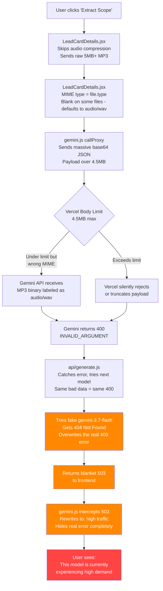

# AI Call Recording Analyzer — Deep Debug Report

**Date:** 2026-08-31  
**Status:** All 5 root-cause bugs identified and fixed  
**Build:** Passed (0 errors)

---

## Executive Summary

The `503 UNAVAILABLE: "This model is currently experiencing high demand"` error was **NOT caused by actual Google AI high demand**. It was a **manufactured false error** created by 5 cascading bugs in the audio extraction pipeline that masked the real failures.

---

## Root Cause: The Error Cascade

Here is exactly what was happening when you clicked "Extract Scope using Gemini AI":



---

## The 5 Bugs Found

### Bug 1: Audio Compression Bypassed
**File:** [LeadCardDetails.jsx](file:///c:/Users/User/Documents/print-to-frame-erp-system/src/components/crm/LeadCardDetails.jsx#L283-L285)

A 90-line `downsampleAudio()` function existed (lines 25-62) that properly compresses audio to 16kHz mono WAV. But line 285 had:
```js
const processedFile = audioFile;  // BYPASSES all compression
```
This sent raw multi-megabyte MP3/M4A files directly, which after base64 encoding (~33% inflation) easily exceeded Vercel's **4.5MB serverless function body limit**.

### Bug 2: Wrong MIME Type Fallback  
**File:** [LeadCardDetails.jsx](file:///c:/Users/User/Documents/print-to-frame-erp-system/src/components/crm/LeadCardDetails.jsx#L305)

```js
processedFile.type || 'audio/wav'  // WRONG fallback
```
When the browser doesn't provide `file.type` (common for `.m4a` on some OS/browser combos), the code told Gemini the data was `audio/wav` when it was actually **MP3 or M4A binary**. Gemini correctly rejected this with a `400 Bad Request`.

### Bug 3: Fake Model in Fallback Array  
**File:** [api/generate.js](file:///c:/Users/User/Documents/print-to-frame-erp-system/api/generate.js#L7)

```js
const CANDIDATE_MODELS = [
  'gemini-2.5-flash',
  'gemini-1.5-flash', 
  'gemini-2.0-flash',
  'gemini-3.7-flash'  // DOES NOT EXIST - returns 404
];
```
`gemini-3.7-flash` is not a real model. When the real models failed with `400 Bad Request` (bad audio data), the loop tried this fake model last, which returned `404 Not Found`. This **overwrote** the helpful 400 error message, erasing the real diagnostic information.

### Bug 4: Blanket 503 for All Errors
**File:** [api/generate.js](file:///c:/Users/User/Documents/print-to-frame-erp-system/api/generate.js#L76-L80)

```js
return res.status(503).json({ error: errorMsg });  // ALWAYS 503
```
Whether the real error was `400 Bad Request`, `401 Auth Error`, or `404 Not Found`, the API proxy **always returned 503 Service Unavailable**. This made every error look like a transient server issue.

### Bug 5: Frontend Error Masking
**File:** [gemini.js](file:///c:/Users/User/Documents/print-to-frame-erp-system/src/services/gemini.js#L57-L61)

```js
} else if (response.status === 503 || errMsg.includes('UNAVAILABLE')) {
  errMsg = "Google AI models are currently experiencing temporary high traffic.";
}
```
The frontend intercepted ANY 503 status and **replaced the actual error** with a hardcoded "high traffic" message. Since Bug 4 converted everything to 503, this line guaranteed that the user could never see the real error.

---

## Fixes Applied

### Fix 1: [LeadCardDetails.jsx](file:///c:/Users/User/Documents/print-to-frame-erp-system/src/components/crm/LeadCardDetails.jsx) — Audio Processing

| Before | After |
|--------|-------|
| Compression bypassed | Auto-compresses files over 3MB via `downsampleAudio()` |
| MIME fallback: `file.type` or `audio/wav` | Extension-based detection: `.mp3` to `audio/mpeg`, `.m4a` to `audio/mp4`, etc. |

### Fix 2: [api/generate.js](file:///c:/Users/User/Documents/print-to-frame-erp-system/api/generate.js) — Server Proxy

| Before | After |
|--------|-------|
| Included fake `gemini-3.7-flash` | Only real models: `2.5-flash`, `2.0-flash`, `1.5-flash` |
| Blanket `503` for all errors | Real status codes: `400`, `413`, `502`, `503` passed through |
| No payload size check | Validates base64 payload under 4.5MB, returns `413` with clear message |
| Retried all models even for data errors | Early-exits on `400 Bad Request` since same bad data gives same result |

### Fix 3: [gemini.js](file:///c:/Users/User/Documents/print-to-frame-erp-system/src/services/gemini.js) — Error Display

| Before | After |
|--------|-------|
| Rewrote 503 to "high traffic" message | Passes real error message through unmodified |
| Hid all diagnostic info | Adds user-friendly prefix for `413` (file too large) and `429` (rate limit) |

---

## What You'll See Now

After these fixes, the user will see the **actual error** if something fails:
- **File too large:** `"Audio file too large for processing..."`  
- **Bad format:** The real Gemini `INVALID_ARGUMENT` message 
- **Actual high demand:** The real 503 message from Google (not a fake one)
- **Success:** Normal extraction with correct MIME type and compressed audio
